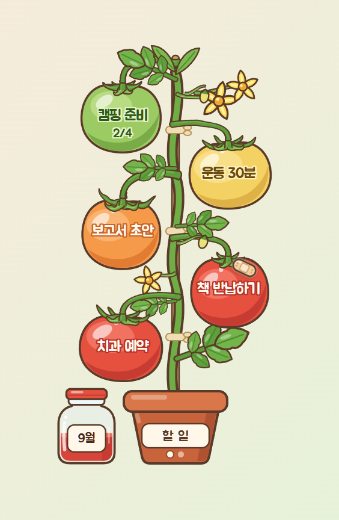
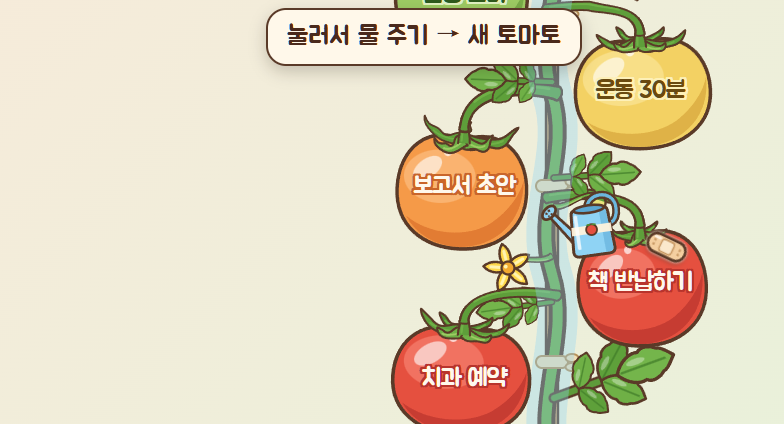
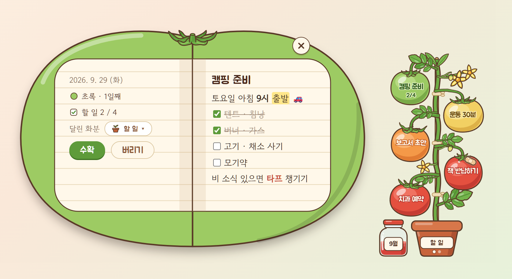
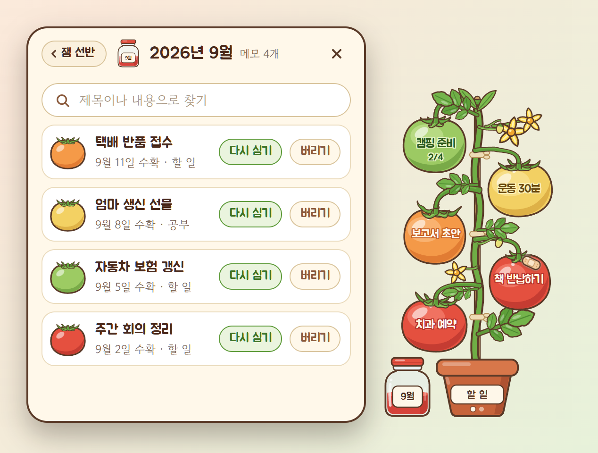
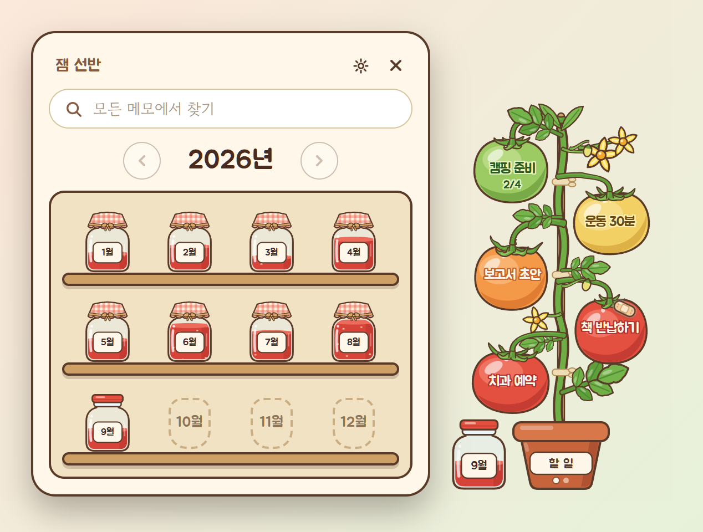
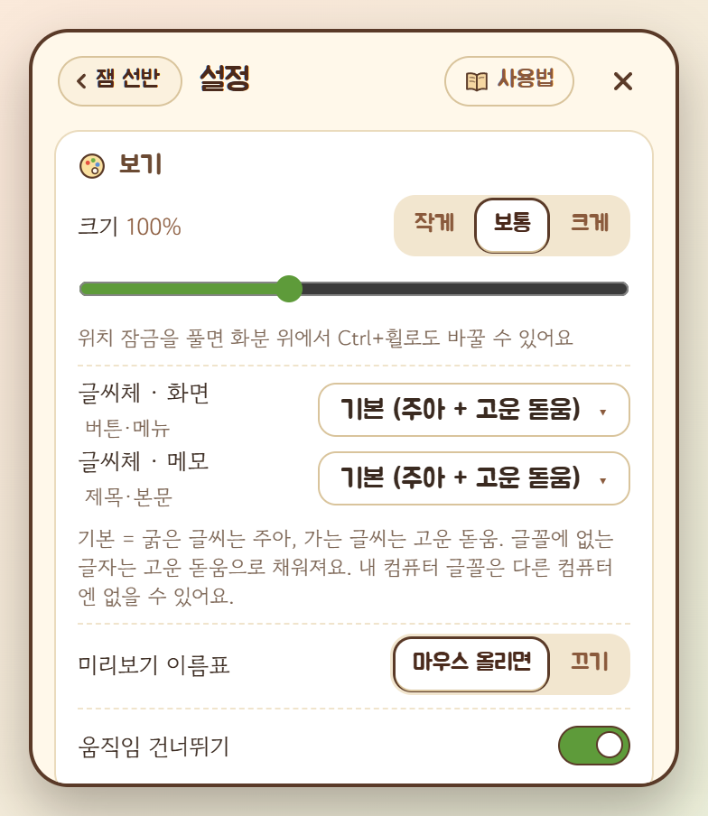
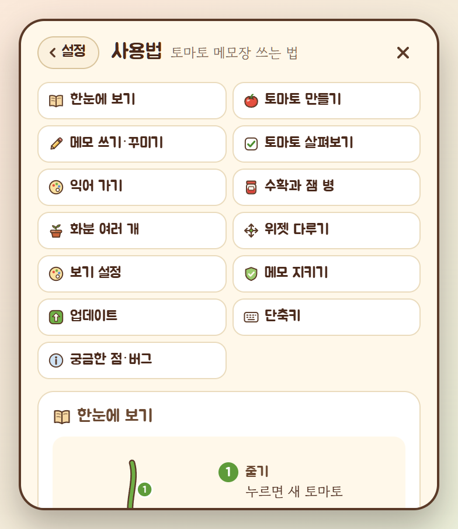

# 🍅 토마토 메모장

**바탕화면에서 토마토를 키우며 쓰는 메모 위젯** (Windows)

작은 화분의 줄기에 물을 주면 꽃이 피고 토마토가 열려요. **토마토 하나가 메모 하나**예요.
메모는 날이 갈수록 초록에서 빨강으로 익어서, 오래 묵은 일이 한눈에 보여요.
다 끝낸 메모는 **수확**해서 이달의 **잼 병**에 담고, 잼 병은 1년짜리 **잼 선반**에 차곡차곡 쌓여요.

  

## 📸 둘러보기

**줄기에 마우스를 올리면 물뿌리개가 나타나요.** 누르면 물을 주고, 꽃이 피었다가 새 토마토가 열려요.

  

**토마토를 누르면 토마토 모양 메모지가 펼쳐져요.** 오른쪽 맨 윗줄이 제목, 그 아래가 본문이에요.
글자를 드래그하면 꾸미기 도구줄이 떠서 체크리스트·글자 색·형광펜으로 꾸밀 수 있어요.
왼쪽 면엔 만든 날짜, 익은 정도, 할 일 진행도가 보여요.

  

<table>
  <tr>
    <td align="center" width="50%"></td>
    <td align="center" width="50%"></td>
  </tr>
  <tr>
    <td align="center"><b>이번 달 잼 병</b> 수확한 메모가 모여요. 다시 심을 수도 있어요.</td>
    <td align="center"><b>잼 선반</b> 1년치 잼 병이 달마다 쌓여요.</td>
  </tr>
  <tr>
    <td align="center" width="50%"></td>
    <td align="center" width="50%"></td>
  </tr>
  <tr>
    <td align="center"><b>설정</b> 묶음별 카드로 정리돼 있어요.</td>
    <td align="center"><b>사용법</b> 그림과 함께 보는 사용 설명서가 앱 안에 있어요.</td>
  </tr>
</table>

사진 속 메모는 모두 예시예요.

---

## ⬇️ 설치하기

1. 오른쪽 **Releases**에서 가장 위(Latest) 버전을 열어요.
2. **`TomatoMemo_버전_x64-setup.exe`** 하나만 받아서 실행해요.
   (다른 파일 `latest.json`, `.sig` 는 자동 업데이트용이라 받지 않아도 돼요.)
3. 설치가 끝나면 바탕화면 오른쪽 아래에 화분이 나타나요.

> **"Windows의 PC 보호" 파란 창이 뜨면?**
> 아직 널리 알려지지 않은 개인 프로그램이라 윈도우가 한 번 확인하는 창이에요.
> **추가 정보 → 실행**을 누르면 설치돼요.

- 관리자 권한 없이 **내 계정에만** 설치돼요.
- 처음 켜면 **윈도우를 켤 때 자동 실행**이 켜져 있어요. **설정 → 위젯 자리**에서 끌 수 있어요.
- 시작 화면에 고정하려면: 시작 메뉴 → 모든 앱 → **TomatoMemo** 오른쪽 클릭 → **시작 화면에 고정**
- 필요한 것: Windows 10 / 11 (64비트)

## 🔄 자동 업데이트

새 버전이 나오면 앱이 알아서 알려 줘요. 켤 때 한 번, 그리고 하루 한 번 확인해요.

- 화분 이름표에 **초록 점**이 생기고, 화분 메뉴 맨 위에 "**새 버전으로 업데이트**"가 나타나요.
- 누르면 받아서 설치하고 다시 켜져요. **누르기 전에는 아무것도 바뀌지 않아요.**
- 업데이트하면 **바뀐 점 카드**가 한 번 떠요. 지난 내용은 **설정 → 정보 → 업데이트 내역**에서 볼 수 있어요.
- 모든 업데이트 파일에는 **디지털 서명**이 붙어 있어요. 앱은 서명이 맞는 파일만 설치해요.

---

## 🌱 이렇게 써요

> 더 자세한 설명은 앱 안 **설정 → 사용법**에 그림과 함께 있어요.

| 하고 싶은 것 | 방법 |
|---|---|
| 새 메모 (토마토 달기) | **줄기 클릭** (물뿌리개로 물 주기). 위젯을 누른 뒤 `Ctrl+N` 도 돼요 |
| 메모 쓰기·보기 | 토마토 클릭 → 토마토 모양 **메모지** (맨 윗줄 제목, `Enter` 로 본문) |
| 열지 않고 살짝 보기 | 토마토에 마우스를 잠깐 올리기 (미리보기 이름표) |
| 닫기 (자동 저장) | X 버튼, `Esc`, 또는 메모지 바깥 클릭 |
| 다 한 메모 | 메모지의 **수확** → 이달의 잼 병으로 (잠깐 뜨는 **되돌리기**로 취소) |
| 이번 달 잼 병 보기 | 화분 옆 **잼 병 클릭** (왼쪽 위 **‹ 잼 선반** 을 누르면 1년치 선반) |
| 메모 찾기 | 잼 선반 맨 위 검색 칸 (줄기·잼 병의 모든 메모) |
| 잼 병 메모를 다시 줄기로 | **다시 심기** → 반창고를 붙이고 돌아와요 |
| 화분 메뉴 | **화분 클릭** 또는 위젯 오른쪽 클릭: 새 토마토 · 잼 선반 보기 · 다른 화분으로 · 새 화분 · 이름 바꾸기 · 위치 잠금 · 사용법 · 설정 |
| 화분 넘기기 | 위젯 위에서 **마우스 휠** |
| 위젯 옮기기 | 화분을 누른 채 끌기 (모니터마다 자리를 기억해요) |
| 크기 바꾸기 | **설정 → 보기**, 또는 위젯 위에서 `Ctrl+휠` |
| 숨기기 / 끄기 | 작업 표시줄 오른쪽 아래 **토마토 아이콘**: 클릭 = 숨기기/보이기, 오른쪽 클릭 = 설정 · 사용법 · 종료 |

### 🍅 익어 가는 토마토
메모를 만든 날부터 색이 변해요. 며칠 만에 익을지는 **설정 → 토마토**에서 바꿀 수 있어요.

`초록` → 2일 `노랑` → 5일 `주황` → 8일 `빨강`

- 원하면 아주 오래된 토마토에 **갈색 반점**이 생기게 할 수도 있어요 (설정, 처음엔 꺼져 있어요).
- 토마토마다 꼭지·열매자루 모양이 조금씩 달라요. 토마토가 많이 달리면 잎도 무성해져요.

### ✍️ 메모지 꾸미기
본문 글자를 드래그하면 도구줄이 떠요. **굵게** · *기울임* · 밑줄 · 취소선 · 형광펜 · 글자 색 · 글머리 기호 · ☑ 체크리스트 · 서식 지우기.
체크리스트를 쓰면 토마토에 `2/5` 처럼 진행도가 보이고, 다 채우면 반짝여요.

| 단축키 | |
|---|---|
| `Ctrl+B` / `Ctrl+I` / `Ctrl+U` | 굵게 / 기울임 / 밑줄 |
| `Ctrl+Shift+S` | 취소선 |
| `Ctrl+Shift+H` | 형광펜 |
| `Ctrl+Shift+8` / `Ctrl+Shift+9` | 글머리 기호 / 체크리스트 |
| `Ctrl+Z` / `Ctrl+Y` | 되돌리기 / 다시 하기 |

### 🍯 잼 병 자리
잼 병은 처음엔 **자동**이에요. 위젯을 화면 오른쪽에 두면 화분 왼쪽에, 왼쪽에 두면 오른쪽에 놓여요 (화면 안쪽).
**설정 → 잼 병**에서 왼쪽·오른쪽으로 고정할 수도 있어요.

### 🗑️ 실수로 지웠다면
- 버린 직후엔 안내 문구의 **되돌리기**를 누르면 돼요.
- 며칠 지났어도 **설정 → 메모 지키기 → 지운 메모 찾기**에서 최근 14일 백업을 뒤져 **되살리기**할 수 있어요. 되살리기 전에 내용도 볼 수 있어요.

---

## 💾 메모는 어디에?

메모는 **내 컴퓨터에만** 저장돼요. 인터넷으로 보내지 않아요.

- 위치: `%USERPROFILE%\.tomatomemo\` (예: `C:\Users\내이름\.tomatomemo`)
- 쓸 때마다 자동 저장하고, **하루 한 번 백업**을 14일치 남겨요.
- 다른 컴퓨터로 옮기거나 따로 보관하고 싶으면 이 폴더를 통째로 복사하면 돼요.

## 💌 피드백·버그 제보

앱 안 **설정 → 정보 → 피드백·버그 제보**에서 만든 사람에게 바로 보낼 수 있어요.

- 보내지는 것: 적은 글, 종류(버그·제안·기타), 적었다면 연락처, 앱 버전·윈도우 버전
- **메모 내용은 보내지 않아요.**

## 🍃 가볍게

가만히 있을 때는 CPU를 거의 쓰지 않도록 만들었어요. 움직임은 누를 때만 잠깐 나타나요.
설정에서 움직임(애니메이션)을 끌 수도 있어요.

---

## 글꼴

- [주아 (Jua)](https://fonts.google.com/specimen/Jua) · [고운 돋움 (Gowun Dodum)](https://fonts.google.com/specimen/Gowun+Dodum) — SIL Open Font License 1.1
- 설정에서 화면 글씨체와 메모 글씨체를 내 컴퓨터의 한글 글꼴로 바꿀 수 있어요.

이 저장소는 설치 파일과 자동 업데이트 파일을 나눠 주는 곳이에요.
